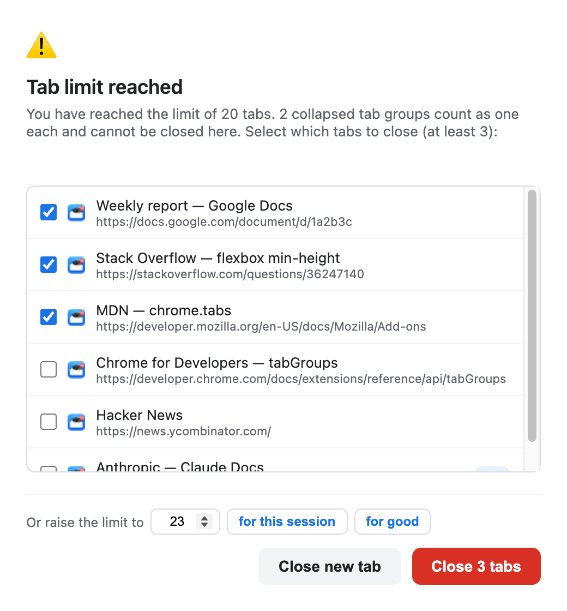
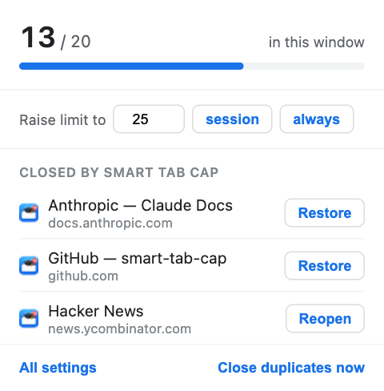
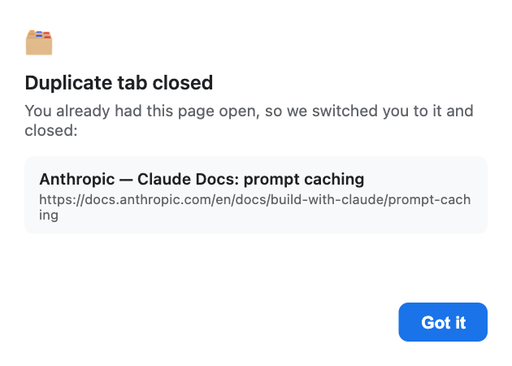
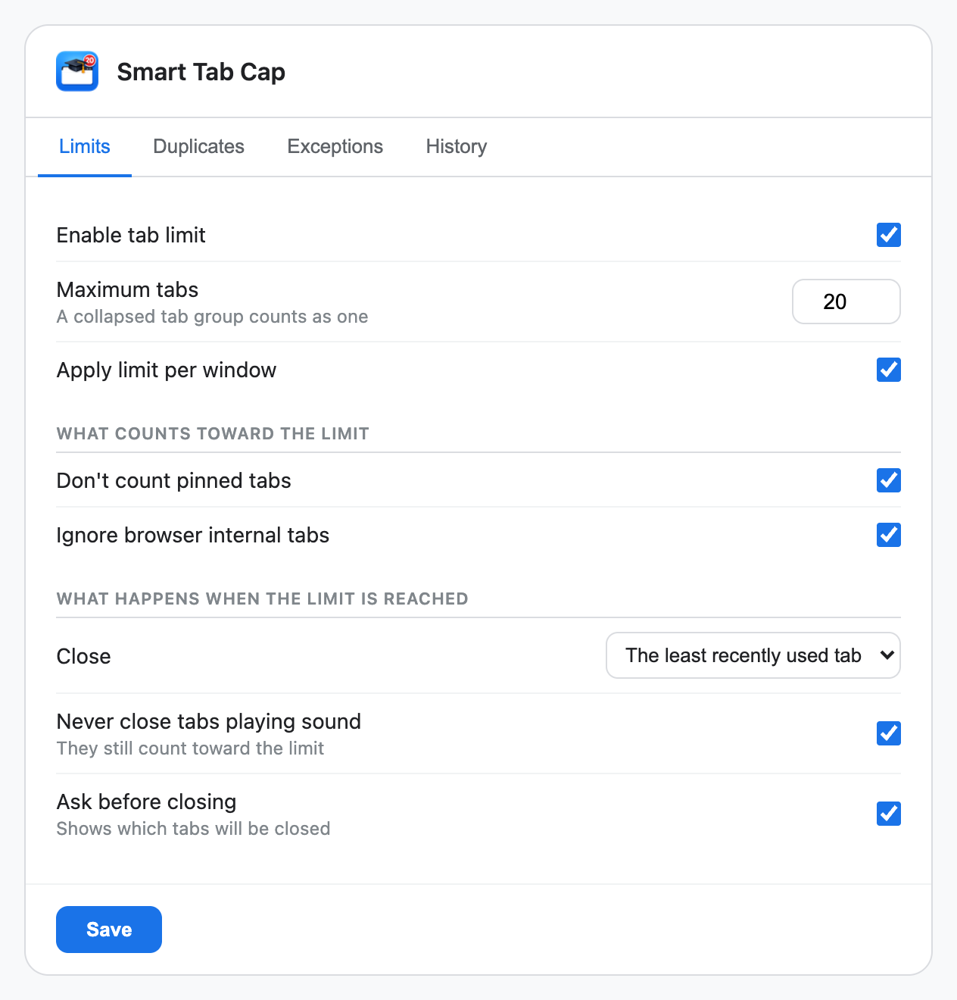
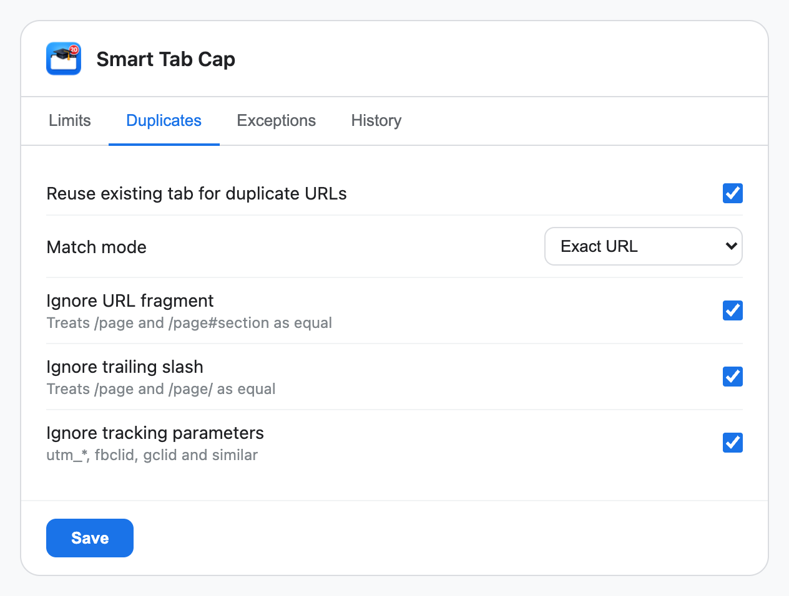
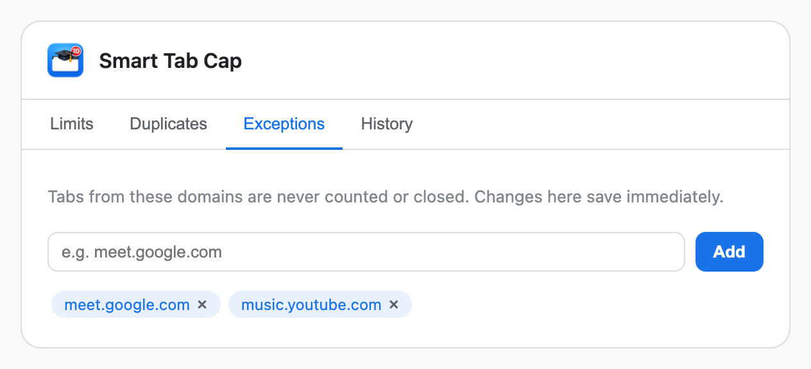
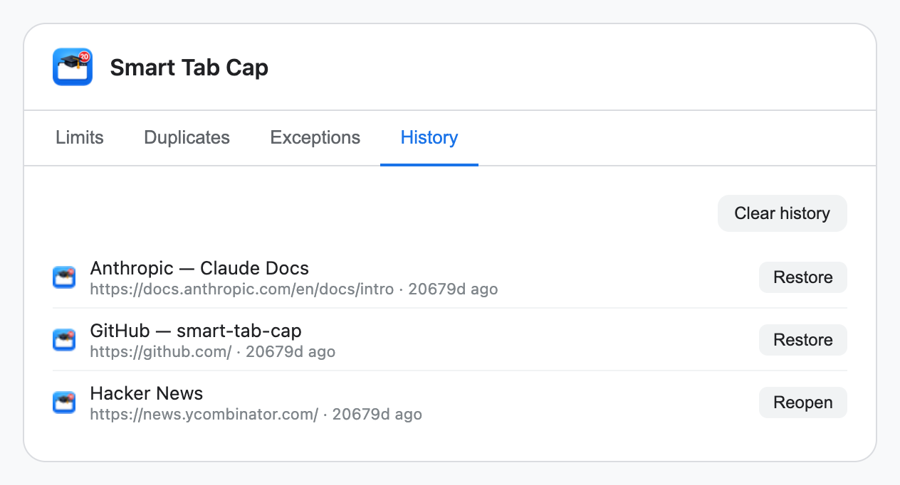

# Smart Tab Cap

A Chrome extension that keeps tab clutter under control two ways: it reuses a tab
you already have open instead of opening a duplicate, and it enforces a limit on
how many tabs you can have at once — with a confirmation you cannot ignore, and an
undo if it takes the wrong one.

[**Website**](https://dos2locos.github.io/smart-tab-cap/) · [**Download 1.9.0**](https://github.com/Dos2Locos/smart-tab-cap/releases/latest)



No build step, no dependencies, no bundler. Plain JavaScript that Chrome loads as
written.

---

## Contents

- [Install](#install)
- [Manual](#manual)
  - [The toolbar popup](#the-toolbar-popup)
  - [Reaching the tab limit](#reaching-the-tab-limit)
  - [Duplicate tabs](#duplicate-tabs)
  - [Settings](#settings)
- [What counts toward the limit](#what-counts-toward-the-limit)
- [Permissions, and why each one](#permissions-and-why-each-one)
- [Known limitations](#known-limitations)
- [Development](#development)
- [Privacy](#privacy)
- [License](#license)

---

## Install

There is no Chrome Web Store listing, so this is a manual install. It takes about a
minute.

1. **Download** the packaged release:
   [**smart-tab-cap-1.9.0.zip**](https://github.com/Dos2Locos/smart-tab-cap/releases/latest)
   (46 KB).

2. **Unzip it** somewhere you will not delete by accident — your home folder, not
   Downloads. Chrome loads the extension from that folder every time it starts, so
   it has to stay put. You get a `smart-tab-cap/` folder.

3. Open `chrome://extensions` in Chrome.

4. Turn on **Developer mode** (top right).

5. Click **Load unpacked** and select the unzipped `smart-tab-cap/` folder — the one
   containing `manifest.json`.

6. Chrome will ask you to confirm the permissions. [What each one is
   for](#permissions-and-why-each-one).

Developer mode has to stay on: Chrome disables unpacked extensions when it is
switched off. Chrome also shows a "Disable developer mode extensions" warning on
each restart, which you can dismiss.

That is it — the extension is active and its icon is in the toolbar. If you do not
see the icon, click the puzzle-piece button and pin **Smart Tab Cap**.

### Updating

Download the newer zip and unzip it **over the same folder**, then press the **↻**
reload button on the extension's card in `chrome://extensions`. Keeping the path
identical matters: Chrome derives the extension's identity from its folder, so a new
location registers as a second, separate extension.

Your settings survive an update either way — they live in Chrome's synced storage,
not in the folder.

---

## Manual

### The toolbar popup

Click the icon for the current state and the two things you most often want.



- **The count** is what the limit is measured against — not the raw number of tabs.
  See [what counts toward the limit](#what-counts-toward-the-limit). The bar turns
  amber two below the limit and red when you reach it.
- **Raise limit to** takes effect immediately. **session** lasts until you close
  Chrome; **always** is saved permanently. If a session raise is active, the popup
  says so and tells you what the limit returns to.
- **Closed by Smart Tab Cap** lists what it took, most recent first. The button says
  **Restore** when the tab can come back with its back-history and scroll position,
  and **Reopen** when only the URL is left. It never claims more than it can do.
- **Close duplicates now** sweeps every window immediately, rather than waiting for
  you to open something.

### Reaching the tab limit

By default the extension closes the least recently used tab silently. Turn on
**Ask before closing** and you get this window instead:


- Pre-ticked are the tabs it would have closed on its own. Change the selection
  freely; **Confirm stays disabled until you have selected enough**.
- The list only contains tabs that may actually be closed. Protected ones — playing
  sound, or inside a collapsed group — are not offered.
- **Or raise the limit to** is the way out that costs you no tabs. The minimum
  offered is what currently counts toward the limit, so raising it always resolves
  the window rather than reopening it.
- The window holds the screen on purpose: it comes back to the front if you click
  away, un-minimises itself, and reopens if you close it with the window control.
  Tabs you open while it is waiting are closed immediately. That is the point of the
  feature — the limit is not a suggestion.

### Duplicate tabs

Open a URL you already have open and the extension switches you to the existing tab,
closes the new one, and tells you what it did:



It stays until you click **Got it** — no timer, and it does not vanish when you click
elsewhere. If you would rather it never appeared, turn off **Reuse existing tab for
duplicate URLs** in Settings → Duplicates.

Two tabs count as duplicates according to your **match mode**, and by default the
comparison ignores the URL fragment, a trailing slash, and tracking parameters
(`utm_*`, `fbclid`, `gclid` and similar) — so the same article shared two different
ways is recognised as one page.

### Settings

Open them from the popup's **All settings**, or from `chrome://extensions`.

#### Limits



Grouped by the question each setting answers. **What counts toward the limit** and
**what happens when the limit is reached** are genuinely different things: a tab
playing sound still counts, it just is never the one closed.

| Setting | What it does |
|---|---|
| **Enable tab limit** | Master switch |
| **Maximum tabs** | The limit. A collapsed tab group counts as one |
| **Apply limit per window** | Off means the limit is across every window together |
| **Don't count pinned tabs** | Pinned tabs become invisible to the limit |
| **Ignore browser internal tabs** | `chrome://`, `about:` and extension pages never count |
| **Close** | The least recently used tab, or the tab you just opened |
| **Never close tabs playing sound** | Protects it from being closed; it still counts |
| **Ask before closing** | Shows the confirmation window instead of acting silently |

#### Duplicates



**Match mode** is the one worth thinking about:

- **Exact URL** — safest, and the default.
- **Same domain + path** — ignores the query string, so `?page=2` is the same page.
- **Same domain only** — aggressive. Opening *any* GitHub page would jump you to
  the GitHub tab you already have. The panel warns you when you select it.

#### Exceptions



Domains listed here are never counted and never closed — meeting rooms, music, a
dashboard you keep open. Subdomains are covered, so `google.com` also matches
`meet.google.com`. Changes save as you make them; there is no Save button on this
panel because there is nothing waiting to be saved.

#### History



The last 50 tabs the extension closed, with the same **Restore** / **Reopen**
distinction as the popup. Stored on this device only, and never includes browser
internal pages.

---

## What counts toward the limit

The limit counts **what you see on the tab strip**, which is not always the same as
the number of tabs:

| Situation | Counts as |
|---|---|
| An ordinary tab | 1 |
| Four tabs in an **expanded** group | 4 |
| The same group **collapsed** | **1** |
| A pinned tab | 0, if *Don't count pinned tabs* is on |
| A `chrome://` page | 0, if *Ignore browser internal tabs* is on |
| A tab on an excepted domain | 0 |
| A tab playing sound | 1 — it counts, it just is never the one closed |

A collapsed group is one item on your tab strip, so it is one item to the limit. It
is also never offered for closing: sacrificing it would destroy every tab inside to
reclaim a single slot.

---

## Permissions, and why each one

Chrome will list four. None of them grant access to the content of any page — this
extension never reads or changes what is on a website.

| Permission | Chrome's warning | Why it is needed |
|---|---|---|
| `tabs` | *Read your browsing history* | To see tab URLs and titles at all. Comparing URLs is the whole duplicate feature, and the confirmation window has to be able to name the tabs it is about to close |
| `tabGroups` | *View and manage your tab groups* | Only to read whether a group is **collapsed**. Group membership comes free with `tabs`; collapsed state does not, and without it a folded-away group could not count as one |
| `sessions` | *Read your browsing history on all your signed-in devices* | To restore a closed tab properly — with its back-history and scroll position — instead of just reopening the URL. This is the widest-sounding warning; it is the price of a real undo |
| `storage` | *(no warning)* | To save your settings and the closed-tab history |

There is deliberately **no** host permission (`<all_urls>`). An earlier design put
the duplicate notice inside the surviving tab, which would have required injecting a
script into every page you visit and the *"read and change all your data on all
websites"* warning. It was rejected in favour of a small popup window.

---

## Known limitations

- **The confirmation window is not a true modal.** Chrome extensions cannot block
  interaction with the browser. It approximates one by returning to the front,
  un-minimising itself, reopening when closed, and closing tabs you open while it
  waits — but you can still click elsewhere.
- **Group names are not shown.** Reading a group's title needs more than the
  collapsed state does, and it was not worth widening the permission for a label.
- **Session restore can expire.** Chrome's recently-closed list rolls over, so an
  old entry falls back to reopening the URL. The button relabels itself to
  **Reopen** when that happens rather than silently doing less than it promised.
- **The limit is not enforced instantly on browser start.** Session restore
  repopulates tabs asynchronously, so enforcement waits five seconds rather than
  judging a half-restored window.

---

## Development

No build step, no package manager, nothing to install. Edit a file, press **↻** in
`chrome://extensions`.

| File | Role |
|---|---|
| `manifest.json` | Manifest V3 declaration |
| `background.js` | Service worker — all the logic |
| `popup.html` / `.js` | Toolbar popup |
| `confirm.html` / `.js` | Tab-limit confirmation window |
| `notice.html` / `.js` | Duplicate-closed acknowledgment |
| `options.html` / `.js` | Settings |

### Tests

Node's built-in test runner, no dependencies:

```bash
node --test test/*.test.js
```

88 tests covering the URL matching, what counts toward the limit, which tabs may be
closed, the confirm-window messages and the closed-tab history.

`background.js` is a classic script rather than a module, so
`test/support/load-background.js` loads it into a `vm` realm wired to a hand-rolled
`chrome` mock — no test framework and nothing to install. One trap worth knowing:
objects crossing that realm boundary carry the realm's own `Object.prototype`, so
spread them before `assert.deepEqual`.

Unit tests cover the logic. They cannot prove Chrome itself behaves as assumed —
for that, load the extension and try it.

---

## Privacy

Nothing is sent anywhere. No server, no account, no analytics, no network requests
of the extension's own. What it reads, what it stores and where, and why each
permission is needed: [PRIVACY.md](PRIVACY.md).

---

## License

MIT — see [LICENSE](LICENSE).
